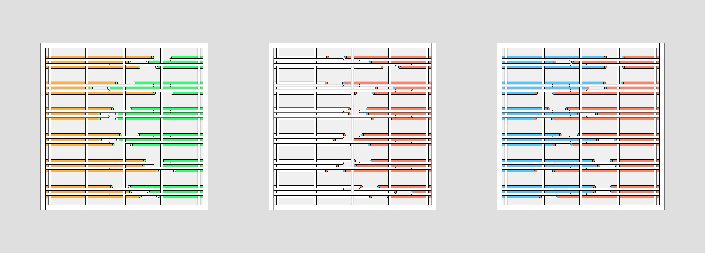
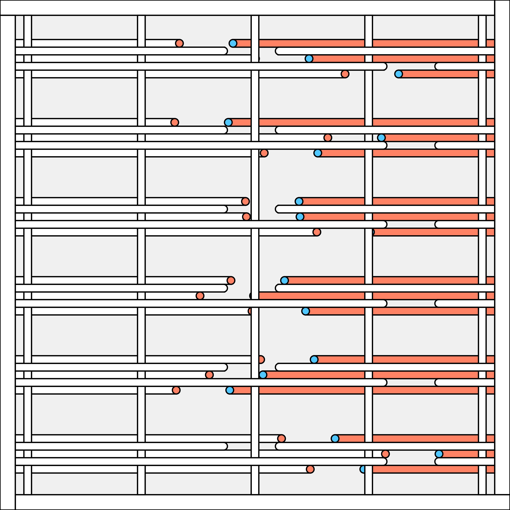
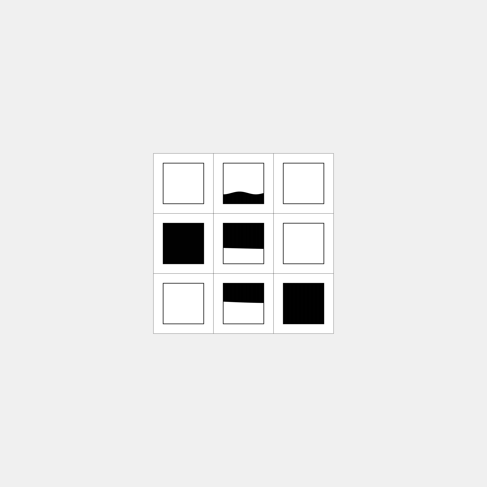
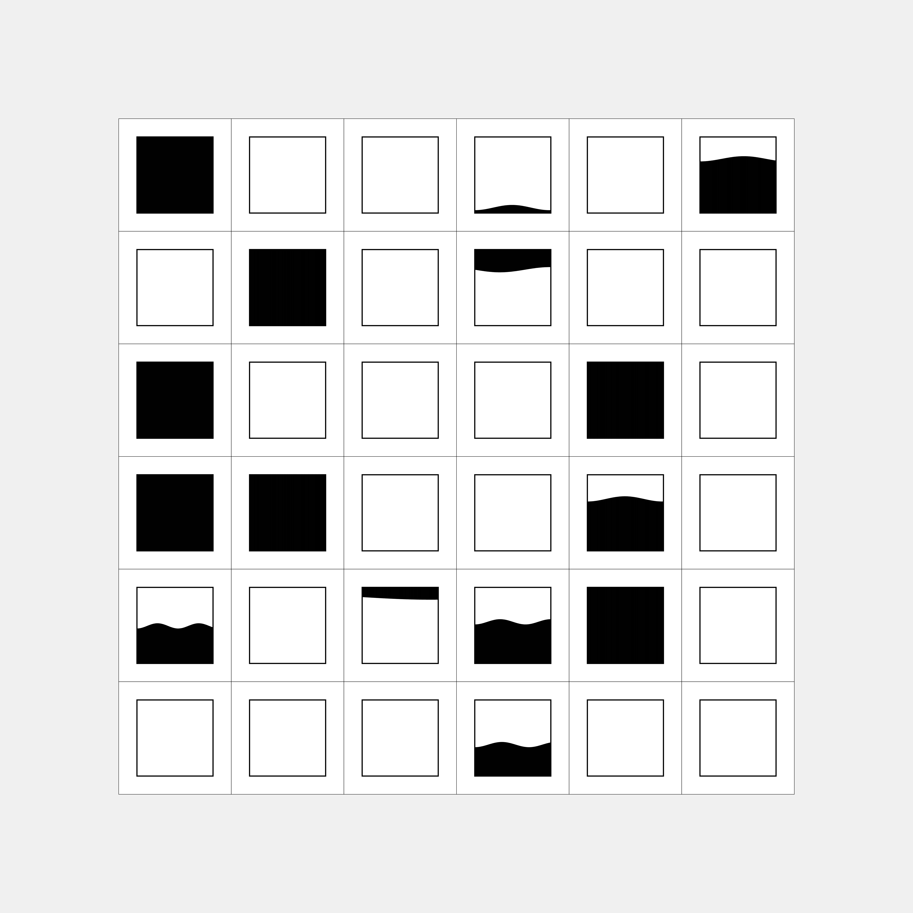

## Construction

> Recreations of Margaret Priest's "The Construction Series" with Processing/Clojure-Quill

---

## Usage

- Run `lein figwheel`
- visit [localhost:3449](http://localhost:3449)

## Publishing your sketch

- run `lein do clean, cljsbuild once optimized`
- access output at `/resources/public/**

